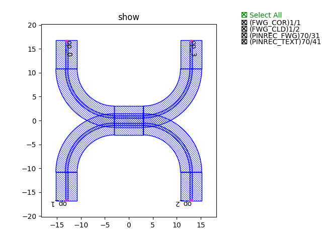
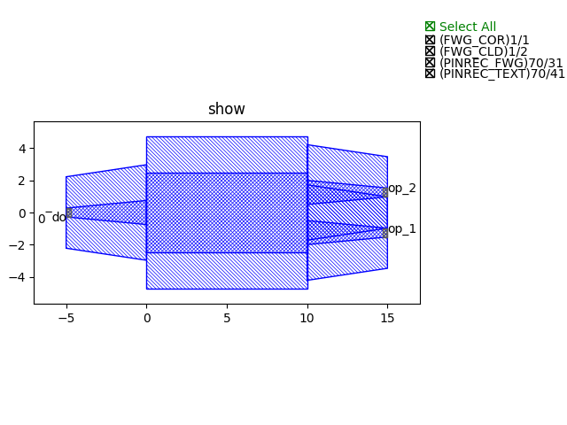

步骤2： 利用基础模块搭建基本链路
^^^^^^^^^^^^^^^^^^^^^^^^^^^^^^^^^^^^^^^^^^^^^^^^

本案例利用基础模块实现了两个基本链路的搭建，包括：

- 定向耦合器_
- 多模干涉仪_

定向耦合器
---------------------------

导入步骤1（:doc:`Step1`）创建的基础模块，这里用到弯曲波导和直波导::

    from step.step1.straight import Straight
    from step.step1.bend_circular import BendCircular

定义定向耦合器类，方便后面直接调用::

    class DirectionalCouplerBend(fp.PCell):

        coupler_spacing: float = fp.PositiveFloatParam(default=0.7, doc="Spacing between the two waveguide centre lines.")
        coupler_length: float = fp.PositiveFloatParam(default=6, doc="Length of the directional coupler")
        bend_radius: float = fp.PositiveFloatParam(required=False, doc="Bend radius for the auto-generated bends")
        straight_after_bend: float = fp.PositiveFloatParam(default=6, doc="Length of the straight waveguide after the bend")
        waveguide_type: CoreCladdingWaveguideType = fp.WaveguideTypeParam(type=CoreCladdingWaveguideType, doc="Waveguide parameters")
        port_names: fp.IPortOptions = fp.PortOptionsParam(count=4, default=["op_0", "op_1", "op_2", "op_3"])

        def _default_waveguide_type(self):
            return get_technology().WG.FWG.C.WIRE

        def build(self) -> Tuple[fp.InstanceSet, fp.ElementSet, fp.PortSet]:
            insts, elems, ports = super().build()
            # fmt: off
            coupler_spacing = self.coupler_spacing
            coupler_length = self.coupler_length
            bend_radius = self.bend_radius
            straight_after_bend = self.straight_after_bend
            waveguide_type = self.waveguide_type
            port_names = self.port_names

            if bend_radius is None:
                bend_radius = cast(float, waveguide_type.BEND_CIRCULAR.radius_eff)  # type: ignore

            dy = coupler_spacing / 2 + waveguide_type.core_width

            left_straight_after_bend = Straight(name="lafterbend", length=straight_after_bend, waveguide_type=waveguide_type)
            right_straight_after_bend = Straight(name="rafterbend",length=straight_after_bend, waveguide_type=waveguide_type)
            left_bend = BendCircular(name="lbend", degrees=90, radius=bend_radius, waveguide_type=waveguide_type)
            right_bend = BendCircular(name="rbend", degrees=90, radius=bend_radius, waveguide_type=waveguide_type)
            straight_coupler = Straight(name="coupler", length=coupler_length, anchor=fp.Anchor.CENTER, waveguide_type=waveguide_type, transform=fp.translate(0, -dy))

            bottom_half = fp.Connected(
                name="bottom",
                joints=[
                    straight_coupler["op_0"] <= left_bend["op_0"],
                    left_bend["op_1"] <= left_straight_after_bend["op_1"],
                    #
                    straight_coupler["op_1"] <= right_bend["op_1"],
                    right_bend["op_0"] <= right_straight_after_bend["op_0"],
                ],
                ports=[
                    left_straight_after_bend["op_0"],
                    right_straight_after_bend["op_1"],
                ],
            )
            insts += bottom_half
            top_half = bottom_half.v_mirrored()
            insts += top_half
            ports += top_half["op_0"].with_name(port_names[0])
            ports += bottom_half["op_0"].with_name(port_names[1]),
            ports += bottom_half["op_1"].with_name(port_names[2]),
            ports += top_half["op_1"].with_name(port_names[3]),

            # fmt: on
            return insts, elems, ports

调用类，生成定向耦合器版图文件并显示图例::

    library += DirectionalCouplerBend(name="f", coupler_spacing=0.5, coupler_length=6, bend_radius=10, straight_after_bend=6, waveguide_type=TECH.WG.FWG.C.WIRE)
    fp.export_gds(library, file=gds_file)
    fp.plot(library) += BendCircular(name="s", radius=15, waveguide_type=TECH.WG.FWG.C.WIRE)
    fp.export_gds(library, file=gds_file)
    fp.plot(library)

定向耦合器图例展示

多模干涉仪
---------------------------

导入步骤1（:doc:`Step1`）创建的基础模块，这里用到直波导和过渡波导::

    from step.step1.straight import Straight
    from step.step1.taper_linear import TaperLinear

定义多模干涉仪类，方便后面直接调用::

    class MMI1x2(fp.PCell):
        mid_wav_core_width: float = fp.PositiveFloatParam(default=5)
        wav_core_width: float = fp.PositiveFloatParam(default=1.5)
        length: float = fp.PositiveFloatParam(default=10)
        transition_length: float = fp.PositiveFloatParam(default=5)
        trace_spacing: float = fp.PositiveFloatParam(default=1)
        waveguide_type: CoreCladdingWaveguideType = fp.WaveguideTypeParam(type=CoreCladdingWaveguideType)

        def _default_waveguide_type(self):
            return get_technology().WG.FWG.C.WIRE

        def build(self) -> Tuple[fp.InstanceSet, fp.ElementSet, fp.PortSet]:
            insts, elems, ports = super().build()
            # fmt: off
            mid_wav_core_width = self.mid_wav_core_width
            wav_core_width=self.wav_core_width
            length = self.length
            transition_length = self.transition_length
            trace_spacing = self.trace_spacing
            waveguide_type = self.waveguide_type

            center_force_cladding_width = mid_wav_core_width+waveguide_type.cladding_width
            center_type = waveguide_type.updated(core_layout_width=mid_wav_core_width, cladding_layout_width=center_force_cladding_width)
            center = Straight(length=length, waveguide_type=center_type, anchor=fp.Anchor.START)
            insts += center

            wide_type = waveguide_type.updated(core_layout_width=wav_core_width, cladding_layout_width=waveguide_type.cladding_width + wav_core_width)
            narrow_type = waveguide_type
            taper_left = TaperLinear(length=transition_length, left_type=narrow_type, right_type=wide_type, anchor=fp.Anchor.END)
            taper_right = TaperLinear(length=transition_length, left_type=wide_type, right_type=narrow_type, anchor=fp.Anchor.START)

            taper_left_inst = taper_left.translated(0, 0)
            insts += taper_left_inst
            ports += taper_left_inst["op_0"].with_name("op_0")

            taper_right_inst1 = taper_right.translated(length, -(wav_core_width+trace_spacing)/2)
            insts += taper_right_inst1
            ports += taper_right_inst1["op_1"].with_name(f"op_1")
            taper_right_inst2 = taper_right.translated(length, (wav_core_width+trace_spacing)/2)
            insts += taper_right_inst2
            ports += taper_right_inst2["op_1"].with_name(f"op_2")

            # fmt: on
            return insts, elems, ports

调用类，生成MMI版图文件并显示图例::

    library += MMI1x2()
    fp.export_gds(library, file=gds_file)
    fp.plot(library)

多模干涉仪图例展示

