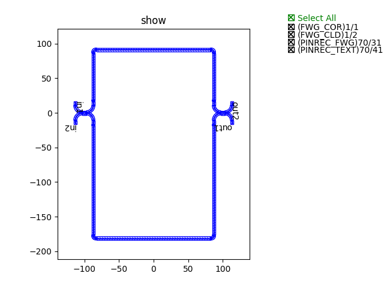
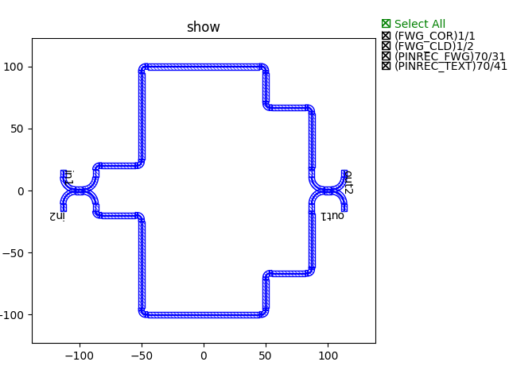
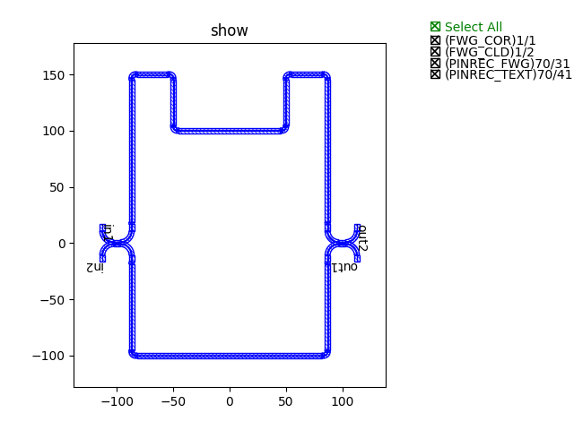

步骤3： 利用基本链路搭建复杂链路
^^^^^^^^^^^^^^^^^^^^^^^^^^^^^^^^^^^^^^^^^^^^^^^^

在步骤2（:doc:`Step2`）中已经利用基础模块搭建了基本的链路。这一小节，继续通过这些基本链路的连接搭建复杂链路实现更多的功能，例如马曾结构。基本模块之间的连接，主要提供三种方式：

- U型定长_
- 路径点_
- 路径线_

下面将从这三种连接类型出发，分别利用这三种方式搭建马曾结构链路。

U型定长
---------------------------

导入步骤2（:doc:`Step2`）创建的定向耦合器::

    from step.step2.directional_coupler_bend import DirectionalCouplerBend

定义马曾干涉仪类，方便后面直接调用::

    class MZI(fp.PCell):

        def build(self):
            insts, elems, ports = super().build()
            TECH = get_technology()

            dc = DirectionalCouplerBend(
                coupler_spacing=0.5,
                coupler_length=6,
                bend_radius=10,
                straight_after_bend=6,
                waveguide_type=TECH.WG.FWG.C.WIRE
            )
            dc1 = dc.translated(-100, 0)
            insts += dc1
            dc2 = dc.translated(100, 0)
            insts += dc2

            device = fp.create_links(
                link_type=TECH.WG.FWG.C.EXPANDED,
                bend_factory=TECH.WG.FWG.C.WIRE.BEND_CIRCULAR,
                specs=[
                    fp.LinkBetween(
                        dc1["op_2"],
                        dc2["op_1"],
                        target_length=500,
                    ),
                    fp.LinkBetween(
                        dc1["op_3"],
                        dc2["op_0"],
                        target_length=320,
                    ),
                ],
            )
            insts += device

            ports += dc1["op_0"].with_name("in1")
            ports += dc1["op_1"].with_name("in2")
            ports += dc2["op_2"].with_name("out1")
            ports += dc2["op_3"].with_name("out2")

            # fmt: on
            return insts, elems, ports

其中::

        device = fp.create_links(
            link_type=TECH.WG.FWG.C.EXPANDED,
            bend_factory=TECH.WG.FWG.C.WIRE.BEND_CIRCULAR,
            specs=[
                fp.LinkBetween(
                    dc1["op_2"],
                    dc2["op_1"],
                    target_length=500,
                ),
                fp.LinkBetween(
                    dc1["op_3"],
                    dc2["op_0"],
                    target_length=320,
                ),
            ],
        )

通过"target_length=320"来实现U型定长连接的。

最终，通过调用类实现生成版图并展示图例::

    device += MZI()
    fp.export_gds(device, file=gds_file)
    fp.plot(device)

采用U型定长方式连接的马曾结构图例展示

路径点
---------------------------

导入步骤2（:doc:`Step2`）创建的定向耦合器::

    from step.step2.directional_coupler_bend import DirectionalCouplerBend

定义马曾干涉仪类，方便后面直接调用::

    class MZI(fp.PCell):
        def build(self):
            insts, elems, ports = super().build()
            TECH = get_technology()

            dc = DirectionalCouplerBend(
                coupler_spacing=0.5,
                coupler_length=6,
                bend_radius=10,
                straight_after_bend=6,
                waveguide_type=TECH.WG.FWG.C.WIRE
            )
            dc1 = dc.translated(-100, 0)
            insts += dc1
            dc2 = dc.translated(100, 0)
            insts += dc2

            device = fp.create_links(
                link_type=TECH.WG.FWG.C.EXPANDED,
                bend_factory=TECH.WG.FWG.C.WIRE.BEND_CIRCULAR,
                specs=[
                    fp.LinkBetween(
                        dc1["op_2"],
                        dc2["op_1"],
                        waypoints=[
                            fp.Waypoint(-50, -70, -90),
                            fp.Waypoint(0, -100, 0),
                            fp.Waypoint(50, -70, 90),
                        ]
                    ),
                    fp.LinkBetween(
                        dc1["op_3"],
                        dc2["op_0"],
                        waypoints=[
                            fp.Waypoint(-50, 70, 90),
                            fp.Waypoint(0, 100, 0),
                            fp.Waypoint(50, 70, -90),
                        ]
                    ),
                ],
            )
            insts += device

            ports += dc1["op_0"].with_name("in1")
            ports += dc1["op_1"].with_name("in2")
            ports += dc2["op_2"].with_name("out1")
            ports += dc2["op_3"].with_name("out2")

            # fmt: on
            return insts, elems, ports

其中::

        device = fp.create_links(
            link_type=TECH.WG.FWG.C.EXPANDED,
            bend_factory=TECH.WG.FWG.C.WIRE.BEND_CIRCULAR,
            specs=[
                fp.LinkBetween(
                    dc1["op_2"],
                    dc2["op_1"],
                    waypoints=[
                        fp.Waypoint(-50, -70, -90),
                        fp.Waypoint(0, -100, 0),
                        fp.Waypoint(50, -70, 90),
                    ]
                ),
                fp.LinkBetween(
                    dc1["op_3"],
                    dc2["op_0"],
                    waypoints=[
                        fp.Waypoint(-50, 70, 90),
                        fp.Waypoint(0, 100, 0),
                        fp.Waypoint(50, 70, -90),
                    ]
                ),
            ],
        )

通过"waypoints"来实现路径点连接的，即连接路线通过所有设置的点。

最终，通过调用类实现生成版图并展示图例::

    device += MZI()
    fp.export_gds(device, file=gds_file)
    fp.plot(device)

采用路径点方式连接的马曾结构图例展示

路径线
---------------------------

导入步骤2（:doc:`Step2`）创建的定向耦合器::

    from step.step2.directional_coupler_bend import DirectionalCouplerBend

定义马曾干涉仪类，方便后面直接调用::

    class MZI(fp.PCell):
        def build(self):
            insts, elems, ports = super().build()
            TECH = get_technology()

            dc = DirectionalCouplerBend(
                coupler_spacing=0.5,
                coupler_length=6,
                bend_radius=10,
                straight_after_bend=6,
                waveguide_type=TECH.WG.FWG.C.WIRE
            )
            dc1 = dc.translated(-100, 0)
            insts += dc1
            dc2 = dc.translated(100, 0)
            insts += dc2

            device = fp.create_links(
                link_type=TECH.WG.FWG.C.EXPANDED,
                bend_factory=TECH.WG.FWG.C.WIRE.BEND_CIRCULAR,
                specs=[
                    fp.LinkBetween(
                        dc1["op_2"],
                        dc2["op_1"],
                        waylines=[fp.until_y(-100)]
                    ),
                    fp.LinkBetween(
                        dc1["op_3"],
                        dc2["op_0"],
                        waylines=[fp.until_y(150),
                                  fp.until_x(-50),
                                  fp.until_y(100),
                                  fp.until_x(50),
                                  fp.until_y(150)]
                    ),
                ],
            )
            insts += device

            ports += dc1["op_0"].with_name("in1")
            ports += dc1["op_1"].with_name("in2")
            ports += dc2["op_2"].with_name("out1")
            ports += dc2["op_3"].with_name("out2")

            # fmt: on
            return insts, elems, ports

其中::

        device = fp.create_links(
            link_type=TECH.WG.FWG.C.EXPANDED,
            bend_factory=TECH.WG.FWG.C.WIRE.BEND_CIRCULAR,
            specs=[
                fp.LinkBetween(
                    dc1["op_2"],
                    dc2["op_1"],
                    waylines=[fp.until_y(-100)]
                ),
                fp.LinkBetween(
                    dc1["op_3"],
                    dc2["op_0"],
                    waylines=[fp.until_y(150),
                              fp.until_x(-50),
                              fp.until_y(100),
                              fp.until_x(50),
                              fp.until_y(150)]
                ),
            ],
        )

通过"waylines"来实现路径线连接的。

最终，通过调用类实现生成版图并展示图例::

    device += MZI()
    fp.export_gds(device, file=gds_file)
    fp.plot(device)

采用路径点方式连接的马曾结构图例展示

