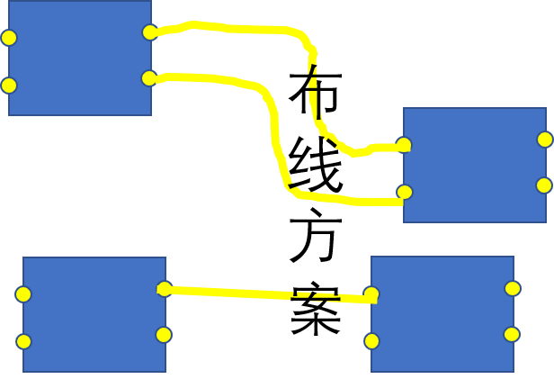
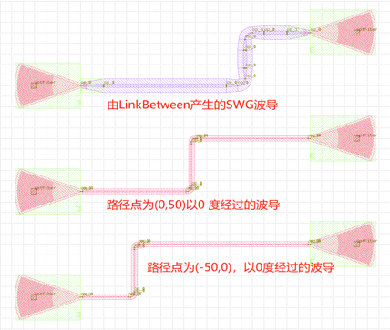
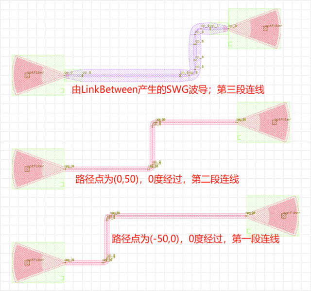
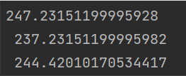

多端口至多端口
====================

多端口至多端口一共有三种连接方式：

- fp.Linked
- fp.creat_links

下面是两种方案的对比

布线方案Linked代码示例 (推荐度★★★)::

    # 调用Linked方法实现器件端口间的互连
    device = fp.Linked(
        # 定义自动布线中直波导的类型
        link_type=TECH.WG.FWG.C.EXPANDED,
        # 定义自动布线时bend的类型
        bend_factory=TECH.WG.FWG.C.WIRE.BEND_CIRCULAR,

        # 在links中定义器件端口之间的连接关系
        links=[
            # 使用 >> 符号定义连接关系
            gc1["op_0"] >> fp.Waypoint(-50, -50, 0) >> gc4["op_0"],
            # 使用fp.Waypoint(x,y)方法定义路径点
            gc2["op_0"] >> fp.Waypoint(0, 50, 0) >> gc5["op_0"],
            # 使用LinkBetween方法来单独定义一段连接，可以通过参数修改直波导和bend的类型
            fp.LinkBetween(
                start=gc3["op_0"],
                end=gc6["op_0"],
                link_type=TECH.WG.SWG.C.EXPANDED,
                bend_factory=TECH.WG.SWG.C.WIRE.BEND_CIRCULAR,
                waypoints=[fp.Waypoint(50, 150, 0)]
            )
        ],
        ports=[],
    )

    # 将linked返回的器件添加到insts
    insts += device

布线方案creat_links代码示例 (推荐度★★★★★)::

    # 调用create_links方法实现器件端口间的互连
    device = fp.create_links(
        # 定义自动布线中直波导的类型
        link_type=TECH.WG.FWG.C.EXPANDED,
        # 定义自动布线时bend的类型
        bend_factory=TECH.WG.FWG.C.WIRE.BEND_CIRCULAR,
        # 在specs中定义器件端口之间的连接关系
        specs=[
            # 使用 >> 符号定义连接关系
            gc1["op_0"] >> fp.Waypoint(-50, -50, 0) >> gc4["op_0"],
            # 使用fp.Waypoint(x,y)方法定义路径点
            gc2["op_0"] >> fp.Waypoint(0, 50, 0) >> gc5["op_0"],
            # 使用LinkBetween方法来单独定义一段连接，可以通过参数修改直波导和bend的类型
            fp.LinkBetween(
                start=gc3["op_0"],
                end=gc6["op_0"],
                link_type=TECH.WG.SWG.C.EXPANDED,
                bend_factory=TECH.WG.SWG.C.WIRE.BEND_CIRCULAR,
                waypoints=[fp.Waypoint(50, 150, 0)]
            )
        ],
    )
    # 获取并打印三段连线的线路长度
    length_1 = device[0].curve_length
    length_2 = device[1].curve_length
    length_3 = device[2].curve_length
    print(f"{length_1} \n {length_2} \n {length_3}")
    # 将create_links返回的器件添加到insts
    insts += device

消息框可以看出打印了三段连线各自的长度。

详细参见代码中注释部分。