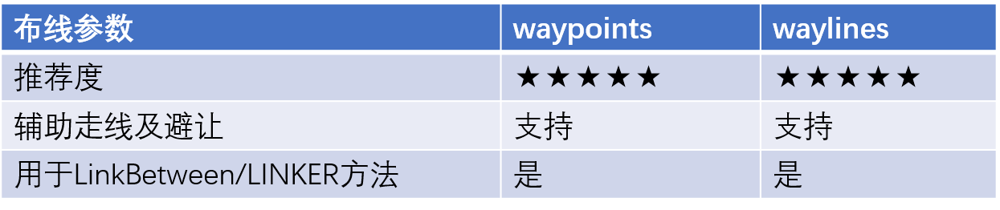
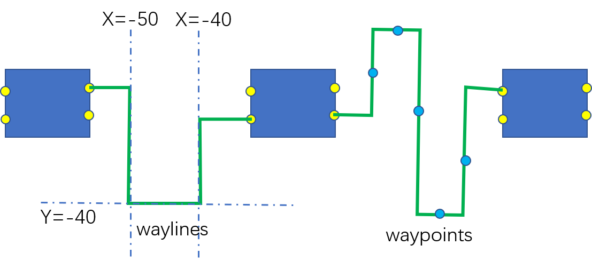
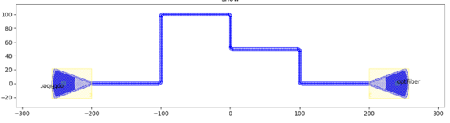
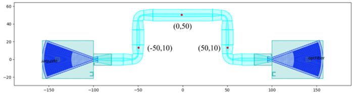
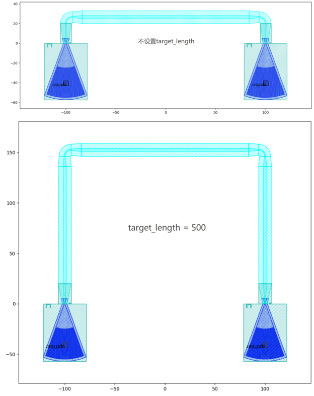

布线路径选择
====================

路径选择一共有两种方式方式：

- waypoints
- waylines

路径点和路径线都作为参数用在布线方法中来辅助波导走线和避让；

路径点和路径线不能同时使用；

路径点可以设置走线角度，路径线可以更简洁的做90度的走线。

下面是两种方案的对比

waylines代码示例1::

    device = fp.LinkBetween(
        start=gc1["op_0"],
        end=gc2["op_0"],
        link_type=TECH.WG.SWG.C.EXPANDED,
        bend_factory=TECH.WG.SWG.C.WIRE.BEND_CIRCULAR,
        # 通过设置waylines让波导依次经过x=-50，y=50和x=50这三条线
        waylines=[fp.until_x(-50), fp.until_y(50), fp.until_x(50)]
    )

.. image:: ../images/routing_way_line1.png

通过设置waylines让波导先经过x=-50这条线，再经过y=50, x=50这两条线。

waylines代码示例1::

    device = fp.LinkBetween(
        start=gc1["op_0"],
        end=gc2["op_0"],
        link_type=TECH.WG.FWG.C.WIRE,
        bend_factory=TECH.WG.FWG.C.WIRE.BEND_CIRCULAR,
        waylines=[
            fp.until_x(x=-100),  # 经过直线x=-100
            fp.until_y(y=fp.START+100),  # 拿到起始端口的纵坐标Y，此处Y=0，并经过直线y=Y+100
            fp.until_x(x=fp.PREV+100),  # 拿到上一次转弯时的横坐标X，此处X=-100，并经过直线x=X+100
            fp.until_y(y=fp.END+50),  # 拿到终止端口的纵坐标Y，此处Y=0，并经过直线y=Y+50
            fp.until_x(x=fp.PREV+100)  # 拿到上一次转弯时的横坐标X，此处X=0，并经过直线x=X+100
                  ]
    )

这里fp.END用来获取end端口的位置，同理可以用fp.START来获取起始端口的位置。另外fp.PREV来实时获得上一个拐点的位置，可以让用户基于上一个拐点来进行后续操作。

waypoints代码示例::

    device = fp.LinkBetween(
        start=gc1["op_0"],
        end=gc2["op_0"],
        link_type=TECH.WG.SWG.C.EXPANDED,
        bend_factory=TECH.WG.SWG.C.WIRE.BEND_CIRCULAR,
        # 设置waypoints引导布线经过路径点，p.Waypoints括号中的三个值分别表示x,y,angle
        waypoints=[
           fp.Waypoint(-50, 10, 90),
           fp.Waypoint(0, 50, 0),
           fp.Waypoint(50, 10, -90)]
    )

    insts += device

设置waypoints引导布线经过路径点；fp.Waypoints括号中的三个值分别表示位置(x,y)和角度angle,angle代表以某个角度经过某个点。

对于两个端口为U型连接的情况，可以在linkbetween和LINKER中设置target_length参数来定义目标长度，波导将自动延长直波导至对应长度，其中target_length为整个布线波导的总长度。

Target_length代码示例::

    device = fp.LinkBetween(
        start=gc1["op_0"],
        end=gc2["op_0"],
        link_type=TECH.WG.SWG.C.EXPANDED,
        bend_factory=TECH.WG.SWG.C.WIRE.BEND_CIRCULAR,
        # 设置target_length
        target_length=500
    )

    insts += device

