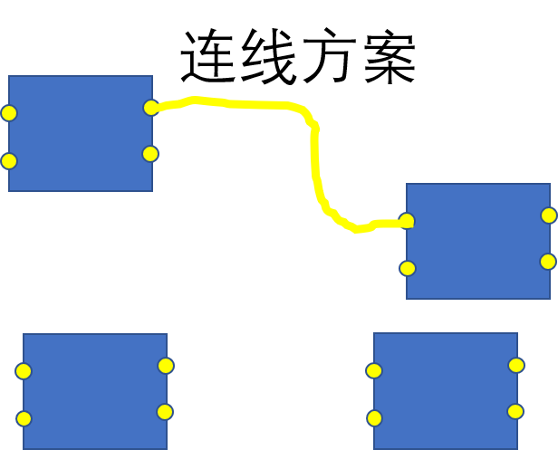
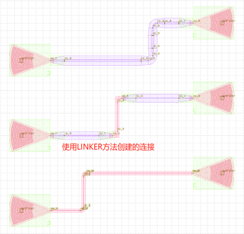

单端口至单端口
====================

单端口至单端口一共有三种连接方式：

- fp.LinkBetween
- TECH.LINKER
- >>

下面是三种方案的对比

其中，LinkBetween方法相对灵活，LINKER方法代码相对简短整洁。

方法案例::

    # 调用create_links方法实现器件端口间的互连
    device = fp.create_links(
        link_type=TECH.WG.FWG.C.EXPANDED, # 定义自动布线中直波导的类型
        bend_factory=TECH.WG.FWG.C.WIRE.BEND_CIRCULAR, # 定义自动布线时bend的类型
        # 在specs中定义器件端口之间的连接关系
        specs=[
            # 使用 >> 符号定义连接关系
            gc1["op_0"] >> fp.Waypoint(-50, -50, 0) >> gc4["op_0"],
            # 使用LINKER方法定义指定器件端口的互联
            TECH.LINKER.SWG_WIRE_FWG_EULER(
                start=gc2["op_0"],
                end=gc5["op_0"],
                waypoints=[fp.Waypoint(0, 50, 0)]
            ),
            # 使用LinkBetween方法来单独定义一段连接，可以通过参数修改直波导和bend的类型
            fp.LinkBetween(
                start=gc3["op_0"],
                end=gc6["op_0"],
                link_type=TECH.WG.SWG.C.EXPANDED,
                bend_factory=TECH.WG.SWG.C.WIRE.BEND_CIRCULAR,
                waypoints=[fp.Waypoint(50, 150, 0)]
            ),
        ],
    )
    # 将Linked返回的器件添加到insts
    insts += device

两种方法具体区别在于：

LinkBetween需要设定linktype和bendfactory来定义布线中的波导和bend；

LINKER是已经配置好的搭配方案，无需再次定义linktype和bendfactory。

代码详解::

    from dataclasses import dataclass
    from fnpcell import all as fp
    from gpdk import all as pdk
    from gpdk.technology import get_technology, PCell

    @dataclass(eq=False)
    class Linked(PCell):
        def build(self):
            insts, elems, ports = super().build()
            TECH = get_technology()
            # fmt: off
            # 调用器件
            GC = pdk.GratingCoupler(waveguide_type=TECH.WG.FWG.C.WIRE)
            # 将器件摆放在不同的位置并将其添加到insts
            gc1 = GC.h_mirrored().translated(-100, -100)
            insts += gc1
            gc2 = GC.h_mirrored().translated(-100, 0)
            insts += gc2
            gc3 = GC.h_mirrored().translated(-100, 100)
            insts += gc3
            gc4 = GC.translated(100, -50)
            insts += gc4
            gc5 = GC.translated(100, 50)
            insts += gc5
            gc6 = GC.translated(100, 150)
            insts += gc6
            # 调用create_links方法实现器件端口间的互连
            device = fp.create_links(
                link_type=TECH.WG.FWG.C.EXPANDED, # 定义自动布线中直波导的类型
                bend_factory=TECH.WG.FWG.C.WIRE.BEND_CIRCULAR, # 定义自动布线时bend的类型
                # 在specs中定义器件端口之间的连接关系
                specs=[
                    # 使用 >> 符号定义连接关系
                    gc1["op_0"] >> fp.Waypoint(-50, -50, 0) >> gc4["op_0"],
                    # 使用LINKER方法定义指定器件端口的互联
                    TECH.LINKER.SWG_WIRE_FWG_EULER(
                        start=gc2["op_0"],
                        end=gc5["op_0"],
                        waypoints=[fp.Waypoint(0, 50, 0)]
                    ),
                   # 使用LinkBetween方法来单独定义一段连接，可以通过参数修改直波导和bend的类型
                    fp.LinkBetween(
                        start=gc3["op_0"],
                        end=gc6["op_0"],
                        link_type=TECH.WG.SWG.C.EXPANDED,
                        bend_factory=TECH.WG.SWG.C.WIRE.BEND_CIRCULAR,
                        waypoints=[fp.Waypoint(50, 150, 0)]
                    ),
                ],
            )
            # 将Linked返回的器件添加到insts
            insts += device

            # fmt: on
            return insts, elems, ports

    if __name__ == "__main__":
        from pathlib import Path

        gds_file = Path(__file__).parent / "local" / Path(__file__).with_suffix(".gds").name
        library = fp.Library()

        TECH = get_technology()
        # ================================================
        # fmt: off

        library += Linked()

        # fmt: on
        # ================================================
        fp.export_gds(library, file=gds_file)
        fp.plot(library)

详细参见代码中注释部分