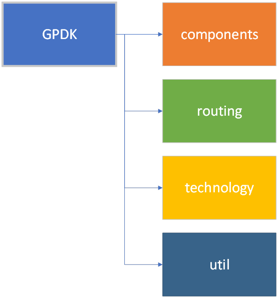

快速配置PDK
====================

这一章旨在帮助用户快速创建使用自己工艺流程的PDK，从而实现自动布局布线。

层级目录：

- components：用于存放基础组件
- routing：自动布局布线
- technology：版图底层相关
- util：配置文件

.. toctree::

    components
    routing
    technology
    util

