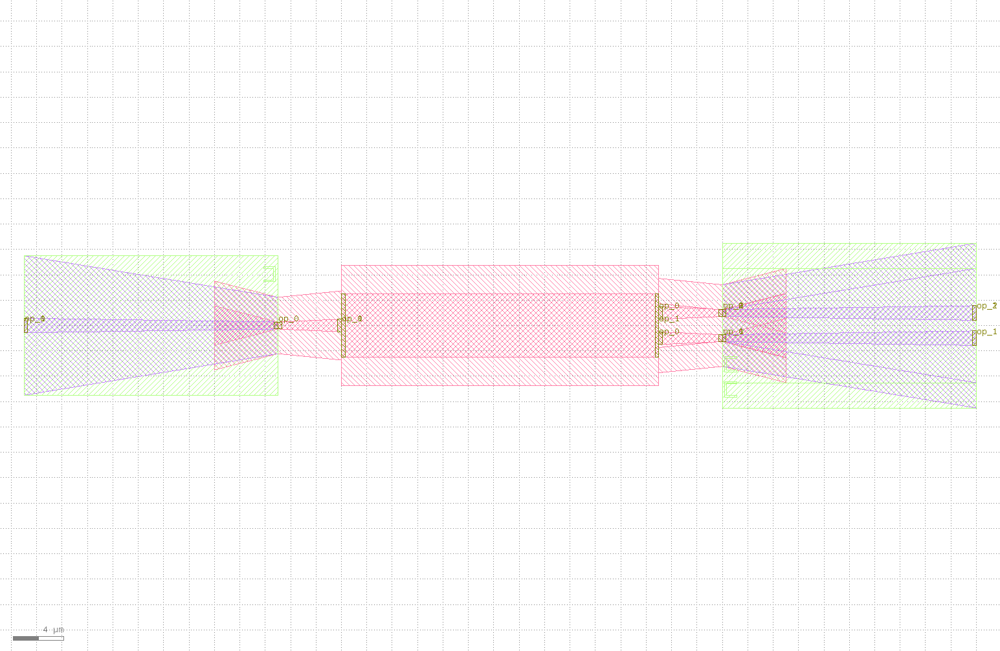

auto_transitioned
====================

器件与器件连接时，很多时候我们会面临端口不匹配问题，此时需要引入taper波导实现过渡。自动端口转换函数为我们提供了端口转换的快速方法。

自动端口转换定义如下::

    @dataclass(eq=False)
    class AutoTransitioned(PCell):
        """
        Attributes:
            device: device whose ports need to be auto-transitioned
            waveguide_type: dict with port name as key, waveguide type as value, "*" means every other port

        Examples:
        ```python
        TECH = get_technology()
            device = AutoTransitioned(device=Mmi(waveguide_type=TECH.WG.FWG.C.WIRE), waveguide_types={"*": WG.SWG.C.WIRE})
        fp.plot(device)
        ```
        
        """

        device: fp.IDevice = fp.DeviceParam()
        waveguide_types: Mapping[str, fp.IWaveguideType] = fp.MappingParam(K=str, V=fp.IWaveguideType, immutable=True)

        def build(self) -> Tuple[fp.InstanceSet, fp.ElementSet, fp.PortSet]:
            insts, elems, ports = super().build()
            TECH = get_technology()
            waveguide_types = self.waveguide_types
            joints: List[Tuple[fp.IOwnedTerminal, fp.IOwnedTerminal]] = []
            transition_ports: List[fp.IOwnedTerminal] = []
            for port in self.device.ports:
                if isinstance(port, fp.IOwnedPort) and not port.disabled:
                    start_type = port.waveguide_type
                    end_type = waveguide_types.get(port.name) or waveguide_types.get("*")
                    if end_type is not None and start_type != end_type:
                        transition, (port_in, port_out) = TECH.AUTO_TRANSITION.DEFAULT[start_type >> end_type]
                        joints.append(port <= transition[port_in])
                        port_name = port.name
                        transition_ports.append(transition[port_out].with_name(fp.Hidden(port_name) if port.hidden and port_name else port_name))

            used_port_names = set(port.name for port in transition_ports)
            unused_ports = [port for port in self.device.ports if not port.disabled and port.name not in used_port_names]
            device = fp.Connected(
                joints=joints,
                ports=transition_ports + unused_ports,
            )
            insts += device
            ports += device.ports

            return insts, elems, ports

更多时候，我们了解如何使用即可::

    library += AutoTransitioned(device=Mmi(waveguide_type=TECH.WG.FWG.C.WIRE), waveguide_types={"*": TECH.WG.SWG.C.WIRE})
    fp.export_gds(library, file=gds_file)

下面分别展示了MMI结构以及对应的经过自动端口转换后结构的版图，其中mmi结构的创建可以参见（:doc:`mmi`）：

.. image:: ../images/comp_mmi.png
