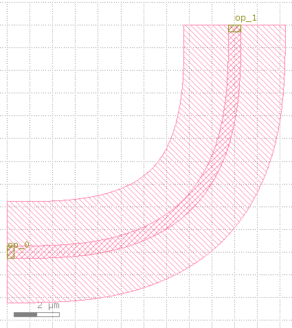

bend_euler
====================

实践证明，作为非线性曲率的欧拉弯曲拥有更好的传输性能。本小节将创建欧拉弯曲组件。

创建步骤如下:

导入库::

    from dataclasses import dataclass
    from functools import cached_property
    from typing import Optional, Tuple

    from fnpcell import all as fp
    from gpdk.technology import get_technology, PCell
    from gpdk.technology.interfaces import CoreCladdingWaveguideType

定义欧拉弯曲类::

    @dataclass(eq=False)
    class BendEuler(fp.IWaveguideLike, PCell):
        """
        Attributes:
            degrees: central angle in degrees
            radius_min: radius minimum
            p: radio of euler spiral in whole bend, 0 < p <= 1, when p = 1, there's no cirular part in the bend
            l_max: max length of euler spiral in half bend

                choose either p or l_max

            waveguide_type: type of waveguide of the bend
            port_names: defaults to ["op_0", "op_1"]

        Examples:
        ```python
        TECH = get_technology()
            bend = BendEuler(name="e90", radius_min=10, degrees=90, waveguide_type=TECH.WG.FWG.C.WIRE)
        fp.plot(bend)
        ```
        
        """

        degrees: float = fp.DegreeParam(default=90, min=-180, max=180, doc="Bend angle in degrees")
        radius_eff: float = fp.PositiveFloatParam(required=False, doc="Bend radius_eff")
        radius_min: float = fp.PositiveFloatParam(required=False, doc="Bend radius_min")
        p: Optional[float] = fp.PositiveFloatParam(required=False, max=1, doc="Bend parameter")
        l_max: Optional[float] = fp.PositiveFloatParam(required=False, doc="Bend Lmax")
        waveguide_type: fp.IWaveguideType = fp.WaveguideTypeParam(doc="Waveguide parameters")
        port_names: fp.IPortOptions = fp.PortOptionsParam(count=2, default=["op_0", "op_1"])

        def _default_radius_eff(self):
            if self.radius_min is None:
                return 10

        def _default_waveguide_type(self):
            return get_technology().WG.FWG.C.WIRE

        def __post_pcell_init__(self):
            assert self.radius_eff is not None or self.radius_min is not None, "either radius_eff or radius_min must be provided"

        @cached_property
        def raw_curve(self):
            radius_min = self.radius_min
            if radius_min is None:
                radius_min = self.radius_eff
            curve = fp.g.EulerBend(radius_min=radius_min, degrees=self.degrees, p=self.p, l_max=self.l_max)
            if self.radius_min is None and not fp.is_close(curve.radius_eff, self.radius_eff):
                curve = curve.scaled(self.radius_eff / curve.radius_eff)
            return curve

        def build(self) -> Tuple[fp.InstanceSet, fp.ElementSet, fp.PortSet]:
            insts, elems, ports = super().build()
            wg = self.waveguide_type(curve=self.raw_curve).with_ports(self.port_names)
            insts += wg
            ports += wg.ports
            return insts, elems, ports

定义90度欧拉弯曲类::

    @dataclass(eq=False)
    class BendEuler90(BendEuler):
        """
        Attributes:
            slab_square: bool, whether draw a square clad

            radius_min: radius minimum
            radius_eff: radius effective

                choose either radius_min(imum) or radius_eff(ective)

            p: radio of euler spiral in whole bend, 0 < p <= 1, when p = 1, there's no cirular part in the bend
            l_max: max length of euler spiral in half bend

                choose either p or l_max

            waveguide_type: type of waveguide of the bend
            port_names: defaults to ["op_0", "op_1"]

        Examples:
        ```python
        TECH = get_technology()
            bend = BendEuler90(name="e90c", radius_min=10, slab_square=True, waveguide_type=TECH.WG.FWG.C.WIRE)
        fp.plot(bend)
        ```
        
        """

        degrees: float = fp.DegreeParam(default=90, min=90, max=90, locked=True, doc="Bend angle in degrees")
        waveguide_type: CoreCladdingWaveguideType = fp.WaveguideTypeParam(type=CoreCladdingWaveguideType, doc="Waveguide parameters")
        slab_square: bool = fp.BooleanParam(required=False, default=False, doc="whether draw a square clad")

        def build(self) -> Tuple[fp.InstanceSet, fp.ElementSet, fp.PortSet]:
            insts, elems, ports = super().build()
            waveguide_type = self.waveguide_type

            if self.slab_square:
                r = self.raw_curve.radius_eff
                w = r + waveguide_type.cladding_width / 2
                x = w / 2
                y = (r - waveguide_type.cladding_width / 2) / 2
                elems += fp.el.Rect(width=w, height=w, center=(x, y), layer=waveguide_type.cladding_layer)

            return insts, elems, ports

这个类定义通过以下方法调用实现版图设计::

    library += BendEuler()
    library += BendEuler90()
    fp.export_gds(library, file=gds_file)

这个类里面定义的仿真可以用于整体链路的仿真。

运行案例，得到的版图文件为:

