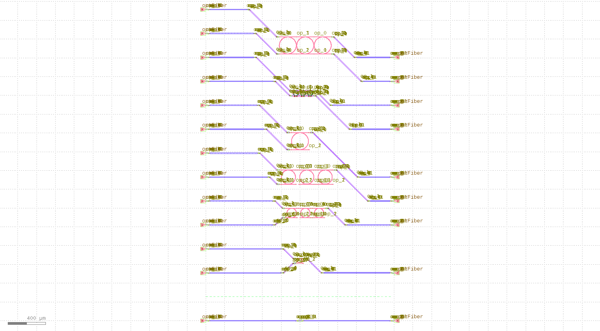

comp_scan
====================

在模块中定义组件，通过该方法可以实现各模块中组件分别自动布线操作。

首先我们需要定义模块::

    blocks = [
        Alignment(
            waveguide_type=TECH.WG.FWG.C.WIRE,
        ),
        Title(
            "TEST TITLE",
            layer=TECH.LAYER.LABEL_DRW,
        ),
        Block(get_ring_resonator_with_terminator(25)),
        Blank(left=0, right=1),
        Block(
            get_ring_resonator_with_terminator(50),
            repeat=3,
        ),
        Block(
            get_ring_resonator_with_terminator(75),
            repeat=3,
        ),
        Block(get_ring_resonator_with_terminator(90), bend_factories=bend_factories),
        Blank(left=0, right=1),
        Block(
            RingFilter(
                ring_radius=25,
                waveguide_type=TECH.WG.FWG.C.WIRE,
            ),
            repeat =3,
        ),
        Block(
            RingResonator(ring_radius=90, ring_type=TECH.WG.FWG.C.WIRE),
            repeat=3,
        ),
    ]

其中，组件部分所调用的函数定义如下::

    from gpdk.components.fixed_terminator_te_1550.fixed_terminator_te_1550 import Fixed_Terminator_TE_1550
    from gpdk.components.ring_filter.ring_filter import RingFilter
    from gpdk.components.ring_resonator.ring_resonator import RingResonator
    from gpdk.routing.extended.extended import Extended
    from gpdk.technology.waveguide_factory import EulerBendFactory
    from gpdk.components.grating_coupler.grating_coupler import GratingCoupler

    def gc_factory(at: fp.IRay, device: fp.IDevice):
        gc = GratingCoupler()  # type: ignore
        return gc, "op_0"

    def bend_factories(waveguide_type: fp.IWaveguideType):
        if waveguide_type == TECH.WG.FWG.C.WIRE:
            return EulerBendFactory(radius_min=35, l_max=35, waveguide_type=waveguide_type)
        elif waveguide_type == TECH.WG.SWG.C.EXPANDED:
            return EulerBendFactory(radius_min=55, l_max=35, waveguide_type=waveguide_type)
        elif waveguide_type == TECH.WG.SWG.C.WIRE:
            return EulerBendFactory(radius_min=45, l_max=35, waveguide_type=waveguide_type)
        return waveguide_type.bend_factory

    def get_ring_resonator_with_terminator(ring_radius: float):
        terminator = Fixed_Terminator_TE_1550(waveguide_type=TECH.WG.FWG.C.WIRE)
        ring_resonator = RingResonator(ring_radius=ring_radius, ring_type=TECH.WG.FWG.C.WIRE)
        # fp.plot(ring_resonator)
        return Extended(
            device=fp.Connected(
                joints=[ring_resonator["op_2"] <= terminator["op_0"]], ports=[ring_resonator["op_0"], ring_resonator["op_1"], ring_resonator["op_3"]]
            ),
            lengths={"*": 20},
        )
        
    def term_factory(at: fp.IRay, device: fp.IDevice):
        from gpdk.components.fixed_terminator_te_1550.fixed_terminator_te_1550 import Fixed_Terminator_TE_1550

        instance = Fixed_Terminator_TE_1550().h_mirrored()  # type: ignore
        return instance, "op_0"

调用comp_scan方法实现自动布局布线::

    library += CompScan(name="comp_scan", spacing=255, width=2000, blocks=blocks, fiber_coupler_factory=term_factory)
    library += CompScan(name="comp_scan", spacing=255, width=2000, blocks=blocks, fiber_coupler_adapter=Fixed_Terminator_TE_1550())
    library += CompScan(name="comp_scan", spacing=255, width=2000, blocks=blocks, bend_factories=bend_factories, fiber_coupler_factory=gc_factory)
    library += CompScan(
        name="comp_scan",
        spacing=255,
        width=2000,
        blocks=blocks,
        bend_factories=bend_factories,
        waveguide_type=TECH.WG.SWG.C.EXPANDED,
        bend_factory=TECH.WG.SWG.C.WIRE.bend_factory,
        connection_type=TECH.WG.MWG.C.WIRE,
        fiber_coupler_factory=gc_factory,
    )

最后生成版图文件::

    gds_file = Path(__file__).parent / "local" / Path(__file__).with_suffix(".gds").name
    library = fp.Library()
    fp.export_gds(library, file=gds_file)

最终生成的版图文件如下图所示：

