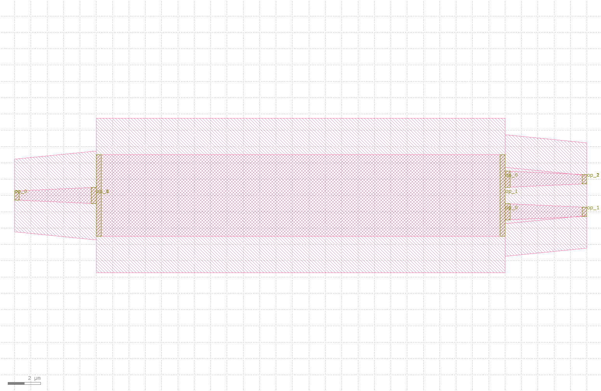
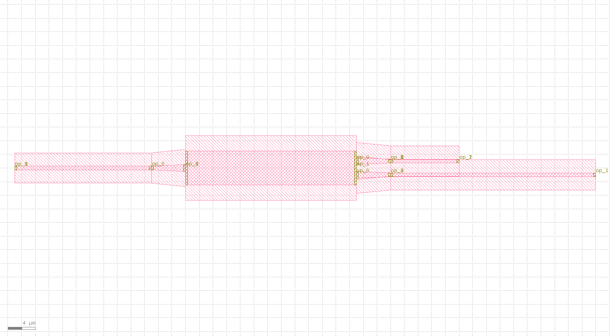

extended
====================

端口延长。

Extended类定义如下::

    @dataclass(eq=False)
    class Extended(PCell):
        """
        Attributes:
            device: device whose ports need to be extended
            lengths: dict with port name as key, length as value, "*" means every other port
            waveguide_type: type of generated waveguide

        Examples:
        ```python
        TECH = get_technology()
            device = Extended(device=Mmi(waveguide_type=TECH.WG.FWG.C.WIRE), lengths={"*": 10, "op_0": 20, "op_1": 30})
        fp.plot(device)
        ```
        
        """

        device: fp.IDevice = fp.DeviceParam()
        lengths: Mapping[str, float] = fp.MappingParam(K=str, V=Number, immutable=True)
        waveguide_type: Optional[fp.IWaveguideType] = fp.WaveguideTypeParam(required=False)

        def build(self) -> Tuple[fp.InstanceSet, fp.ElementSet, fp.PortSet]:
            insts, elems, ports = super().build()
            device = self.device
            lengths = self.lengths
            waveguide_type = self.waveguide_type
            instance = device if waveguide_type is None else AutoTransitioned(device=device, waveguide_types={key: waveguide_type for key in lengths})

            joints: List[Tuple[fp.IOwnedTerminal, fp.IOwnedTerminal]] = []
            straight_ports: List[fp.IOwnedTerminal] = []
            for port in instance.ports:
                if isinstance(port, fp.IOwnedPort) and not port.disabled:
                    length = lengths.get(port.name) or lengths.get("*")
                    if length is not None:
                        if waveguide_type is not None:
                            length -= fp.distance_between(device[port.name].position, instance[port.name].position)
                        assert length > 0 or fp.is_zero(length), f"extend length of {port.name} is too short"
                        if length > 0:
                            s = Straight(length=length, waveguide_type=port.waveguide_type)
                            joints.append(port <= s["op_0"])
                            port_name = port.name
                            straight_ports.append(s["op_1"].with_name(fp.Hidden(port_name) if port.hidden else port_name))

            used_port_names = set(port.name for port in straight_ports)
            unused_ports = [port for port in instance.ports if port.name not in used_port_names]
            connected = fp.Connected(
                joints=joints,
                ports=straight_ports + unused_ports,
            )
            insts += connected
            ports += connected.ports
            return insts, elems, ports

方法需要定义器件以及各端口延长的尺度，同时可以定义生成波导的类型::

    Extended(device=Mmi(waveguide_type=TECH.WG.FWG.C.WIRE), lengths={"*": 10, "op_0": 20, "op_1": 30})

最后生成版图文件::

    gds_file = Path(__file__).parent / "local" / Path(__file__).with_suffix(".gds").name
    library = fp.Library()
    TECH = get_technology()
    from gpdk.components.mmi.mmi import Mmi
    library += Extended(device=Mmi(waveguide_type=TECH.WG.FWG.C.WIRE), lengths={"*": 10, "op_0": 20, "op_1": 30})
    fp.export_gds(library, file=gds_file)

下面分别展示了MMI结构以及对应的经过端口延长后结构的版图，其中mmi结构的创建可以参见（:doc:`mmi`）:


