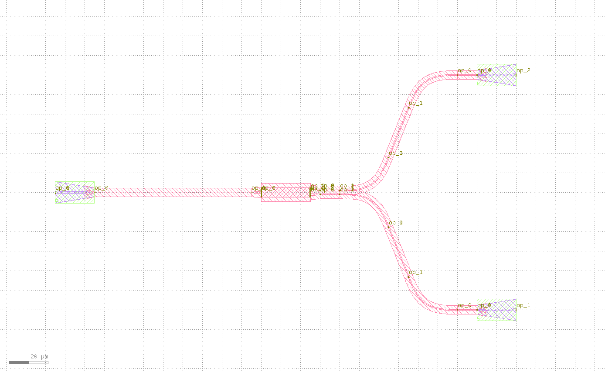

fanout
====================

fanout可以实现器件端口到光栅耦合器的自动布局布线。

fanout类定义如下::

    @dataclass(eq=False)
    class HFanout(PCell):
        """
        Attributes:
            device: device whose ports need fanout
            left_spacing: spacing between left ports
            right_spacing: spacing between right ports
            bend_degrees: defaults to 30 degrees
            bend_factories: a callable which receives an `IWaveguideType` and returns an `IBendWaveguideFactory`
            device_left_ports: Optional, device left ports from top to bottom
            device_right_ports: Optional, device right ports from bottom to top
            left_distance: Optional
            right_distance: Optional
            left_ports: Optional, port options for left ports
            right_ports: Optional, port options for right ports
            left_waveguide_type: Optional, type of left waveguide
            right_waveguide_type: Optional, type of right waveguide
            connect_length: defaults to 10, distance between generated port and sbend

        Examples:
        ```python
        from gpdk.technology.bend_factory import EulerBendFactory

        def bend_factories(waveguide_type: fp.IWaveguideType):
            if waveguide_type == TECH.WG.FWG.C.WIRE:
                return EulerBendFactory(radius_min=15, l_max=15, waveguide_type=waveguide_type)
            return waveguide_type.bend_factory

        device = HFanout(device=Mmi(waveguide_type=TECH.WG.FWG.C.WIRE), left_spacing=120, right_spacing=120, left_distance=100, right_distance=100,
                    bend_factories=bend_factories, left_waveguide_type=TECH.WG.SWG.C.WIRE, right_waveguide_type=TECH.WG.SWG.C.WIRE)
        fp.plot(device)
        ```
        
        """

        device: fp.IDevice = fp.DeviceParam()
        left_spacing: float = fp.PositiveFloatParam()
        right_spacing: float = fp.PositiveFloatParam()
        bend_degrees: float = fp.DegreeParam(default=30, min=0, max=90, invalid=[0])
        bend_factories: Optional[Callable[[fp.IWaveguideType], fp.IBendWaveguideFactory]] = fp.Param(required=False)
        device_left_ports: Sequence[str] = fp.NameListParam(required=False, doc="device left ports from top to bottom")
        device_right_ports: Sequence[str] = fp.NameListParam(required=False, doc="device right ports from bottom to top")
        left_distance: Optional[float] = fp.FloatParam(required=False, min=0)
        right_distance: Optional[float] = fp.FloatParam(required=False, min=0)
        left_ports: Optional[fp.IPortOptions] = fp.PortOptionsParam(required=False)
        right_ports: Optional[fp.IPortOptions] = fp.PortOptionsParam(required=False)
        left_waveguide_type: Optional[fp.IWaveguideType] = fp.WaveguideTypeParam(required=False)
        right_waveguide_type: Optional[fp.IWaveguideType] = fp.WaveguideTypeParam(required=False)
        connect_length: float = fp.PositiveFloatParam(default=10)

        def build(self) -> Tuple[fp.InstanceSet, fp.ElementSet, fp.PortSet]:
            insts, elems, ports = super().build()
            TECH = get_technology()

            device = self.device
            left_spacing = self.left_spacing
            right_spacing = self.right_spacing
            bend_degrees = self.bend_degrees
            bend_factories = self.bend_factories
            device_left_ports = self.device_left_ports
            device_right_ports = self.device_right_ports
            left_distance = self.left_distance
            right_distance = self.right_distance
            left_ports = self.left_ports
            right_ports = self.right_ports
            left_waveguide_type = self.left_waveguide_type
            right_waveguide_type = self.right_waveguide_type
            connect_length = self.connect_length
            if device_left_ports is None:
                device_left_ports = [port.name for port in util.ports.get_left_ports(device)]
            device_left_ports = list(device_left_ports)
            if device_right_ports is None:
                device_right_ports = [port.name for port in util.ports.get_right_ports(device, reverse=True)]
            device_right_ports = list(device_right_ports)
            left_ports = left_ports or device_left_ports
            right_ports = right_ports or device_right_ports

            result_left_ports: List[fp.IOwnedTerminal] = []
            left_joints: List[Tuple[fp.IOwnedTerminal, fp.IOwnedTerminal]] = []

            left_count = len(device_left_ports)
            if len(left_ports) != left_count:
                raise AssertionError("len(left_ports) must be equal to len(device_left_ports)")

            for i in range(left_count // 2):
                device_ltop_port = cast(fp.IOwnedPort, device[device_left_ports[i]])
                ltop_port = device_ltop_port

                device_lbottom_port = cast(fp.IOwnedPort, device[device_left_ports[left_count - i - 1]])
                lbottom_port = device_lbottom_port

                ltop_distance = left_distance
                lbottom_distance = left_distance

                if ltop_distance:
                    ltop_distance -= connect_length * 2
                if lbottom_distance:
                    lbottom_distance -= connect_length * 2

                ltop_transition = None
                lbottom_transition = None
                if left_waveguide_type:
                    if ltop_port.waveguide_type != left_waveguide_type:
                        if not ltop_distance:
                            raise AssertionError("left_distance is required for auto transition")
                        ltop_transition, (port_in, port_out) = TECH.AUTO_TRANSITION.DEFAULT[ltop_port.waveguide_type >> left_waveguide_type]
                        ltop_distance -= fp.distance_between(ltop_transition[port_in].position, ltop_transition[port_out].position)

                    if lbottom_port.waveguide_type != left_waveguide_type:
                        if not lbottom_distance:
                            raise AssertionError("left_distance is required for auto transition")
                        lbottom_transition, (port_in, port_out) = TECH.AUTO_TRANSITION.DEFAULT[lbottom_port.waveguide_type >> left_waveguide_type]
                        lbottom_distance -= fp.distance_between(lbottom_transition[port_in].position, lbottom_transition[port_out].position)
                lconnect_top1 = Straight(
                    name="lctop1",
                    length=connect_length,
                    waveguide_type=ltop_port.waveguide_type,
                )
                lconnect_top2 = Straight(
                    name="lctop2",
                    length=connect_length,
                    waveguide_type=ltop_port.waveguide_type,
                )
                lconnect_bottom1 = Straight(
                    name="lcbottom1",
                    length=connect_length,
                    waveguide_type=lbottom_port.waveguide_type,
                )
                lconnect_bottom2 = Straight(
                    name="lcbottom2",
                    length=connect_length,
                    waveguide_type=lbottom_port.waveguide_type,
                )
                ltop_sbend, lbottom_sbend = SBendPair(
                    top_distance=ltop_distance,
                    bottom_distance=lbottom_distance,
                    left_spacing=left_spacing * (left_count - i * 2 - 1),
                    right_spacing=fp.distance_between(ltop_port.position, lbottom_port.position),
                    bend_degrees=bend_degrees,
                    top_type=ltop_port.waveguide_type,
                    bottom_type=lbottom_port.waveguide_type,
                    top_bend_factory=bend_factories and bend_factories(ltop_port.waveguide_type),
                    bottom_bend_factory=bend_factories and bend_factories(lbottom_port.waveguide_type),
                )
                left_joints.append(ltop_port <= lconnect_top1["op_1"])
                left_joints.append(lconnect_top1["op_0"] <= ltop_sbend["op_1"])
                left_joints.append(ltop_sbend["op_0"] <= lconnect_top2["op_1"])
                ltop_port = lconnect_top2["op_0"]
                left_joints.append(lbottom_port <= lconnect_bottom1["op_1"])
                left_joints.append(lconnect_bottom1["op_0"] <= lbottom_sbend["op_1"])
                left_joints.append(lbottom_sbend["op_0"] <= lconnect_bottom2["op_1"])
                lbottom_port = lconnect_bottom2["op_0"]

                if ltop_transition:
                    left_joints.append(ltop_port <= ltop_transition["op_0"])
                    ltop_port = ltop_transition["op_1"]
                if lbottom_transition:
                    left_joints.append(lbottom_port <= lbottom_transition["op_0"])
                    lbottom_port = lbottom_transition["op_1"]

                result_left_ports.insert(0, ltop_port)
                result_left_ports.append(lbottom_port)

                if not left_distance:
                    left_distance = abs(ltop_port.position[0] - device_ltop_port.position[0])

            if left_distance and left_count % 2:
                lindex = left_count // 2
                lmiddle_port = cast(fp.IOwnedPort, device[device_left_ports[lindex]])

                lmiddle_distance = left_distance
                lmiddle_transition = None
                if left_waveguide_type and lmiddle_port.waveguide_type != left_waveguide_type:
                    if not lmiddle_distance:
                        raise AssertionError("middle_distance is required for auto transition")
                    lmiddle_transition, (port_in, port_out) = TECH.AUTO_TRANSITION.DEFAULT[lmiddle_port.waveguide_type >> left_waveguide_type]
                    lmiddle_distance -= fp.distance_between(lmiddle_transition[port_in].position, lmiddle_transition[port_out].position)

                lstraight = Straight(
                    name="lmiddle",
                    length=lmiddle_distance,
                    waveguide_type=lmiddle_port.waveguide_type,
                )
                left_joints.append(lmiddle_port <= lstraight["op_1"])
                lmiddle_port = lstraight["op_0"]

                if lmiddle_transition:
                    left_joints.append(lmiddle_port <= lmiddle_transition["op_0"])
                    lmiddle_port = lmiddle_transition["op_1"]

                result_left_ports.insert(lindex, lmiddle_port)

            ############################

            result_right_ports: List[fp.IOwnedTerminal] = []
            right_joints: List[Tuple[fp.IOwnedTerminal, fp.IOwnedTerminal]] = []

            right_count = len(device_right_ports)
            if len(right_ports) != right_count:
                raise AssertionError("len(right_ports) must be equal to len(device_right_ports)")

            for i in range(right_count // 2):
                device_rbottom_port = cast(fp.IOwnedPort, device[device_right_ports[i]])
                rbottom_port = device_rbottom_port
                device_rtop_port = cast(fp.IOwnedPort, device[device_right_ports[right_count - i - 1]])
                rtop_port = device_rtop_port

                rbottom_distance = right_distance
                rtop_distance = right_distance

                if rbottom_distance:
                    rbottom_distance -= connect_length * 2
                if rtop_distance:
                    rtop_distance -= connect_length * 2

                rbottom_transition = None
                rtop_transition = None
                if right_waveguide_type:
                    if rbottom_port.waveguide_type != right_waveguide_type:
                        if not rbottom_distance:
                            raise AssertionError("right_distance is required for auto transition")
                        rbottom_transition, (port_in, port_out) = TECH.AUTO_TRANSITION.DEFAULT[rbottom_port.waveguide_type >> right_waveguide_type]
                        rbottom_distance -= fp.distance_between(rbottom_transition[port_in].position, rbottom_transition[port_out].position)
                    if rtop_port.waveguide_type != right_waveguide_type:
                        if not rtop_distance:
                            raise AssertionError("right_distance is required for auto transition")
                        rtop_transition, (port_in, port_out) = TECH.AUTO_TRANSITION.DEFAULT[rtop_port.waveguide_type >> right_waveguide_type]
                        rtop_distance -= fp.distance_between(rtop_transition[port_in].position, rtop_transition[port_out].position)
                rconnect_top1 = Straight(
                    name="rctop1",
                    length=connect_length,
                    waveguide_type=rtop_port.waveguide_type,
                )
                rconnect_top2 = Straight(
                    name="rctop2",
                    length=connect_length,
                    waveguide_type=rtop_port.waveguide_type,
                )
                rconnect_bottom1 = Straight(
                    name="rcbottom1",
                    length=connect_length,
                    waveguide_type=rbottom_port.waveguide_type,
                )
                rconnect_bottom2 = Straight(
                    name="rcbottom2",
                    length=connect_length,
                    waveguide_type=rbottom_port.waveguide_type,
                )
                rtop_sbend, rbottom_sbend = SBendPair(
                    top_distance=rtop_distance,
                    bottom_distance=rbottom_distance,
                    left_spacing=fp.distance_between(rtop_port.position, rbottom_port.position),
                    right_spacing=right_spacing * (right_count - i * 2 - 1),
                    bend_degrees=bend_degrees,
                    top_type=rtop_port.waveguide_type,
                    bottom_type=rbottom_port.waveguide_type,
                    top_bend_factory=bend_factories and bend_factories(rtop_port.waveguide_type),
                    bottom_bend_factory=bend_factories and bend_factories(rbottom_port.waveguide_type),
                )
                right_joints.append(rbottom_port <= rconnect_bottom1["op_0"])
                right_joints.append(rconnect_bottom1["op_1"] <= rbottom_sbend["op_0"])
                right_joints.append(rbottom_sbend["op_1"] <= rconnect_bottom2["op_0"])
                rbottom_port = rconnect_bottom2["op_1"]
                right_joints.append(rtop_port <= rconnect_top1["op_0"])
                right_joints.append(rconnect_top1["op_1"] <= rtop_sbend["op_0"])
                right_joints.append(rtop_sbend["op_1"] <= rconnect_top2["op_0"])
                rtop_port = rconnect_top2["op_1"]

                if rbottom_transition:
                    right_joints.append(rbottom_port <= rbottom_transition["op_0"])
                    rbottom_port = rbottom_transition["op_1"]
                if rtop_transition:
                    right_joints.append(rtop_port <= rtop_transition["op_0"])
                    rtop_port = rtop_transition["op_1"]

                result_right_ports.insert(0, rbottom_port)
                result_right_ports.append(rtop_port)
                if not right_distance:
                    right_distance = abs(rbottom_port.position[0] - device_rbottom_port.position[0])

            if right_distance and right_count % 2:
                rindex = right_count // 2
                rmiddle_port = cast(fp.IOwnedPort, device[device_right_ports[rindex]])

                rmiddle_distance = left_distance
                rmiddle_transition = None
                if right_waveguide_type and rmiddle_port.waveguide_type != right_waveguide_type:
                    if not rmiddle_distance:
                        raise AssertionError("middle_distance is required for auto transition")
                    rmiddle_transition, (port_in, port_out) = TECH.AUTO_TRANSITION.DEFAULT[rmiddle_port.waveguide_type >> right_waveguide_type]
                    rmiddle_distance -= fp.distance_between(rmiddle_transition[port_in].position, rmiddle_transition[port_out].position)

                rstraight = Straight(
                    name="rmiddle",
                    length=right_distance,
                    waveguide_type=rmiddle_port.waveguide_type,
                )
                right_joints.append(rmiddle_port <= rstraight["op_0"])
                rmiddle_port = rstraight["op_1"]

                if rmiddle_transition:
                    left_joints.append(rmiddle_port <= rmiddle_transition["op_0"])
                    rmiddle_port = rmiddle_transition["op_1"]

                result_right_ports.insert(rindex, rmiddle_port)

            used_port_names = frozenset((device_left_ports or []) + (device_right_ports or []))
            unused_ports = [port for port in device.ports if port.name not in used_port_names]

            connected = fp.Connected(
                joints=left_joints + right_joints,
                ports=(
                    ([port.with_name(left_ports[i]) for i, port in enumerate(result_left_ports)])
                    + ([port.with_name(right_ports[i]) for i, port in enumerate(result_right_ports)])
                    + unused_ports
                ),
            )
            insts += connected
            ports += connected.ports
            return insts, elems, ports

主要参数描述::

    device: 器件
    left_spacing: 左侧端口的间距
    right_spacing: 右侧端口的间距
    bend_degrees: 弯曲波导弯曲角度
    device_left_ports: 需要配置的端口，从上至下
    device_right_ports: 需要配置的端口，从下至上
    left_distance: 左侧输出端口的距离
    right_distance: 右侧输出端口的距离
    left_waveguide_type: 左侧波导类型
    right_waveguide_type: 右侧波导类型

调用案例::

    gds_file = Path(__file__).parent / "local" / Path(__file__).with_suffix(".gds").name
    from gpdk.technology.bend_factory import EulerBendFactory
    library = fp.Library()
    TECH = get_technology()
    from gpdk.components.mmi.mmi import Mmi

    def bend_factories(waveguide_type: fp.IWaveguideType):
        if waveguide_type == TECH.WG.FWG.C.WIRE:
            return EulerBendFactory(radius_min=15, l_max=15, waveguide_type=waveguide_type)
        return waveguide_type.bend_factory

    library += [
            HFanout(name="mmi",device=Mmi(waveguide_type=TECH.WG.FWG.C.WIRE), left_spacing=600, right_spacing=500, left_distance=100,
                    right_distance=100,
                    bend_factories=bend_factories, left_waveguide_type=TECH.WG.SWG.C.WIRE,
                    right_waveguide_type=TECH.WG.SWG.C.WIRE)
        ]
    fp.export_gds(library, file=gds_file)

下面分别展示了MMI结构以及对应的经过端口延长后结构的版图，其中mmi结构的创建可以参见（:doc:`mmi`）:

.. image:: ../images/comp_mmi.png
