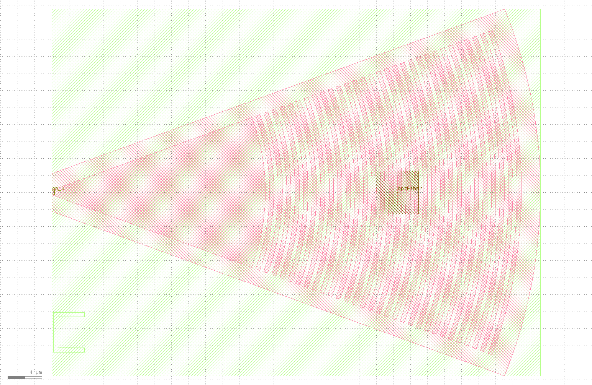

grating_coupler
====================

光栅耦合器可以将光源从光纤中耦合到片上，并将片上光源耦合到光纤中的重要组件。

创建步骤如下:

导入库::

    from dataclasses import dataclass
    import math
    from typing import List, Tuple, cast
    from fnpcell import all as fp

    from gpdk.technology import get_technology, PCell
    from gpdk.technology.interfaces import CoreCladdingWaveguideType

定义光栅耦合器类::

    @dataclass(eq=False)
    class GratingCoupler(PCell, band="C"):
        """
        Attributes:
            length: defaults to 25.0
            half_degrees: defaults to 20
            ellipse_ratio: defaults to 1.0, Ellipse(Major/Minor)
            tooth_width: defaults to 0.5
            etch_width: defaults to 0.5
            teeth: defaults to 30
            waveguide_type: type of waveguide
            port_names: defaults to ["op_0"]

        Examples:
        ```python
        TECH = get_technology()
        gc = GratingCoupler(name="f", etch_width=0.5, tooth_width=0.5, length=25, half_degrees=40, teeth=30, waveguide_type=TECH.WG.FWG.C.WIRE)
        fp.plot(gc)
        ```
        
        """

        length: float = fp.PositiveFloatParam(default=25.0)
        half_degrees: float = fp.DegreeParam(default=20)
        ellipse_ratio: float = fp.PositiveFloatParam(default=1.0, min=1.0, doc="Ellipse(Major/Minor)")
        tooth_width: float = fp.PositiveFloatParam(default=0.5)
        etch_width: float = fp.PositiveFloatParam(default=0.5)
        teeth: int = fp.IntParam(default=30, min=0, doc="Number of tooth")
        waveguide_type: CoreCladdingWaveguideType = fp.WaveguideTypeParam(type=CoreCladdingWaveguideType)
        port_names: fp.IPortOptions = fp.PortOptionsParam(count=1, default=["op_0"])

        def _default_waveguide_type(self):
            return get_technology().WG.FWG.C.WIRE

        def build(self) -> Tuple[fp.InstanceSet, fp.ElementSet, fp.PortSet]:
            insts, elems, ports = super().build()
            TECH = get_technology()
            # fmt: off
            length = self.length
            half_degrees=self.half_degrees
            ellipse_ratio = self.ellipse_ratio
            tooth_width = self.tooth_width
            etch_width = self.etch_width
            teeth = self.teeth
            waveguide_type = self.waveguide_type
            port_names = self.port_names

            overlap = 1.0
            fiber_pin_width = 5

            half_angle = math.radians(half_degrees)
            waveguide_width = waveguide_type.core_width
            waveguide_cladding = waveguide_type.cladding_width
            waveguide_layer = waveguide_type.core_layer
            cladding_layer = waveguide_type.cladding_layer
            si_etch1_layer = TECH.WG.MWG.C.WIRE.core_layer
            fbrtgt = TECH.LAYER.FIBREC_NOTE

            content:List[fp.IPolygon] = []
            # move gap line to the other side
            content.append(
                fp.el.EllipticalRing(outer_radius=(length, length / ellipse_ratio), layer=waveguide_layer, transform=fp.h_mirror()))

            final_tooth_radius = length
            for _ in range(teeth):
                final_tooth_radius = final_tooth_radius + etch_width

                inner_radius_x = final_tooth_radius
                inner_radius_y = inner_radius_x / ellipse_ratio

                final_tooth_radius = final_tooth_radius + tooth_width

                outer_radius_x = final_tooth_radius
                outer_radius_y = outer_radius_x / ellipse_ratio
                # move gap line to the other side
                content.append(fp.el.EllipticalRing(outer_radius=(outer_radius_x, outer_radius_y), inner_radius=(inner_radius_x, inner_radius_y), layer=waveguide_layer, transform=fp.h_mirror()))

            delta_radius = (waveguide_width / 2.0) / math.tan(half_angle)
            wedge_y = math.tan(half_angle) * (delta_radius + final_tooth_radius)

            trapezoid = fp.el.Line(length=final_tooth_radius, stroke_width=waveguide_width, final_stroke_width=wedge_y * 2, layer=waveguide_layer)

            content = list(fp.el.PolygonSet(content, layer=waveguide_layer) & trapezoid)

            fiber_pin_tooth = 1 + int(teeth / 2)  # 1 for wedge_polygon
            fiber_pin_x = min(content[fiber_pin_tooth].polygon_points, key=lambda p: p[0])[0]

            overlap_x = final_tooth_radius + overlap
            overlap_y = overlap_x / ellipse_ratio

            overlap_polygon = fp.el.EllipticalRing(outer_radius=(overlap_x, overlap_y), layer=si_etch1_layer, transform=fp.rotate(radians=math.pi))

            inner_angle = math.pi / 2 - half_angle
            perpendicular_overlap = overlap / math.sin(inner_angle)
            overlap_delta = (perpendicular_overlap + (waveguide_width / 2)) / math.tan(half_angle)
            overlap_wedge_y = math.tan(half_angle) * (overlap_delta + final_tooth_radius + overlap)
            # overlap_wedge_x = overlap_delta + final_tooth_radius + overlap

            trapezoid = fp.el.Line(length=overlap_x, stroke_width=waveguide_width + perpendicular_overlap * 2, final_stroke_width=overlap_wedge_y * 2, layer=si_etch1_layer)
            overlap_polygon &= trapezoid

            # content.append(overlap_polygon)  # temporary commented for Circuit 01

            cladding_x = final_tooth_radius + waveguide_cladding / 2
            cladding_y = cladding_x / ellipse_ratio

            cladding_polygon = fp.el.EllipticalRing(outer_radius=(cladding_x, cladding_y), layer=cladding_layer, transform=fp.rotate(radians=math.pi))
            trapezoid = fp.el.Line(length=cladding_x, stroke_width=waveguide_cladding, final_stroke_width=math.tan(half_angle) * cladding_x * 2 + waveguide_cladding, layer=cladding_layer)
            cladding_polygon &= trapezoid
            content.extend(cladding_polygon)

            # fiber port
            elements = cast(List[fp.IElement], content)
            elements.extend(
                [
                    fp.el.Line(length=fiber_pin_width, stroke_width=fiber_pin_width, layer=fbrtgt, transform=fp.translate(fiber_pin_x, 0)),
                    fp.el.Text(content="optFiber", text_anchor=fp.Anchor.CENTER, vertical_align=fp.VertialAlign.MIDDLE, layer=fbrtgt, at=(fiber_pin_x + fiber_pin_width / 2, 0)),
                ]
            )
            ports += fp.Port(name=port_names[0], position=(0, 0), orientation=math.pi, waveguide_type=waveguide_type)
            elems += elements

            # fmt: on
            return insts, elems, ports


这个类定义通过以下方法调用实现版图设计::

    library += GratingCoupler()
    fp.export_gds(library, file=gds_file)

这个类里面定义的仿真可以用于整体链路的仿真。

运行案例，得到的版图文件为:

