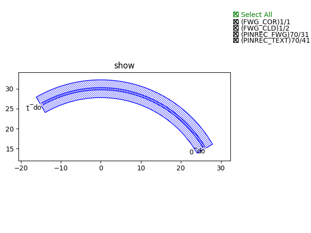
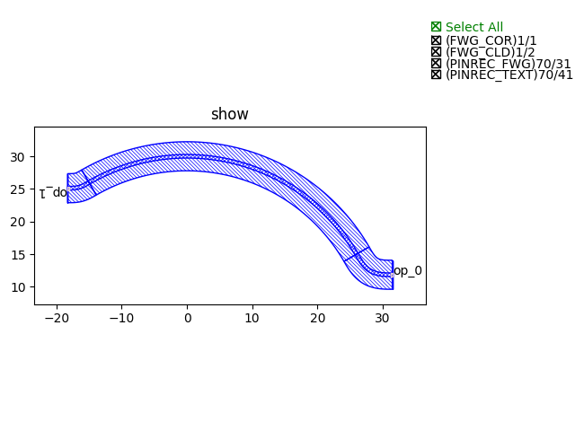

horizontalized
====================

弯曲波导端口水平化。

首先我们需要定义Horizontalized方法::

    @dataclass(eq=False)
    class Horizontalized(PCell):
        """
        Attributes:
            device: device whose ports need to be horizontalized
            bend_factory: Optional, bend waveguide factory
            straight_type: Optional, type of final short straight
            straight_length: defaults to 0.1, length of final short straight

        Examples:
        ```python
        TECH = get_technology()
            device = Horizontalized(device=BendCircular(radius=30, waveguide_type=TECH.WG.FWG.C.WIRE, transform=fp.rotate(degrees=30)))
        fp.plot(device)
        ```
        
        """

        device: fp.IDevice = fp.DeviceParam()
        bend_factory: Optional[fp.IBendWaveguideFactory] = fp.Param(required=False)
        straight_type: Optional[fp.IWaveguideType] = fp.WaveguideTypeParam(required=False)
        straight_length: float = fp.PositiveFloatParam(default=0.1)

        def build(self) -> Tuple[fp.InstanceSet, fp.ElementSet, fp.PortSet]:
            insts, elems, ports = super().build()
            TECH = get_technology()

            bend_factory = self.bend_factory
            straight_type = self.straight_type
            straight_length = self.straight_length

            PI = math.pi
            HALF_PI = PI / 2

            content: List[fp.IDevice] = [self.device]
            for port in self.device.ports:
                if isinstance(port, fp.IOwnedPort) and not port.disabled:
                    port_name = port.name
                    port_orientation = fp.normalize_angle(port.orientation)
                    final_orientation = None
                    if -HALF_PI < port_orientation < HALF_PI:
                        final_orientation = 0
                    elif HALF_PI < port_orientation < PI or -PI < port_orientation < -HALF_PI:
                        final_orientation = PI

                    if final_orientation is not None:
                        turning_angle = fp.normalize_angle(final_orientation - port_orientation)
                        if fp.is_nonzero(turning_angle):
                            port = util.links.bend(TECH, content, start=port, radians=turning_angle, bend_factory=bend_factory)
                            if straight_length is not None:
                                port = util.links.straight(TECH, content, start=port, length=straight_length, end_type=straight_type)
                            port = port.with_name(port_name)

                ports += port

            insts += content
            return insts, elems, ports

其中，组件部分所调用的函数定义如下::

    from gpdk.components.fixed_terminator_te_1550.fixed_terminator_te_1550 import Fixed_Terminator_TE_1550
    from gpdk.components.ring_filter.ring_filter import RingFilter
    from gpdk.components.ring_resonator.ring_resonator import RingResonator
    from gpdk.routing.extended.extended import Extended
    from gpdk.technology.waveguide_factory import EulerBendFactory
    from gpdk.components.grating_coupler.grating_coupler import GratingCoupler

    def gc_factory(at: fp.IRay, device: fp.IDevice):
        gc = GratingCoupler()  # type: ignore
        return gc, "op_0"

    def bend_factories(waveguide_type: fp.IWaveguideType):
        if waveguide_type == TECH.WG.FWG.C.WIRE:
            return EulerBendFactory(radius_min=35, l_max=35, waveguide_type=waveguide_type)
        elif waveguide_type == TECH.WG.SWG.C.EXPANDED:
            return EulerBendFactory(radius_min=55, l_max=35, waveguide_type=waveguide_type)
        elif waveguide_type == TECH.WG.SWG.C.WIRE:
            return EulerBendFactory(radius_min=45, l_max=35, waveguide_type=waveguide_type)
        return waveguide_type.bend_factory

    def get_ring_resonator_with_terminator(ring_radius: float):
        terminator = Fixed_Terminator_TE_1550(waveguide_type=TECH.WG.FWG.C.WIRE)
        ring_resonator = RingResonator(ring_radius=ring_radius, ring_type=TECH.WG.FWG.C.WIRE)
        # fp.plot(ring_resonator)
        return Extended(
            device=fp.Connected(
                joints=[ring_resonator["op_2"] <= terminator["op_0"]], ports=[ring_resonator["op_0"], ring_resonator["op_1"], ring_resonator["op_3"]]
            ),
            lengths={"*": 20},
        )
        
    def term_factory(at: fp.IRay, device: fp.IDevice):
        from gpdk.components.fixed_terminator_te_1550.fixed_terminator_te_1550 import Fixed_Terminator_TE_1550

        instance = Fixed_Terminator_TE_1550().h_mirrored()  # type: ignore
        return instance, "op_0"

调用方法实现自动布局布线，并生成版图文件::

    from pathlib import Path
    gds_file = Path(__file__).parent / "local" / Path(__file__).with_suffix(".gds").name
    library = fp.Library()
    TECH = get_technology()
    from gpdk.components.bend.bend_circular import BendCircular
    from gpdk.technology.waveguide_factory import EulerBendFactory
    library += Horizontalized(device=BendCircular(radius=30, waveguide_type=TECH.WG.FWG.C.WIRE, transform=fp.rotate(degrees=30)))
    fp.export_gds(library, file=gds_file)


案例如下图所示：


