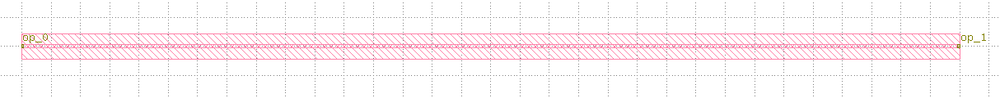

straight
====================

直波导是光子集成链路不可或缺的组件。

创建步骤如下:

导入库::

    from dataclasses import dataclass
    from functools import cached_property
    from typing import Tuple

    from fnpcell import all as fp
    from fnpcell.interfaces import angle_between, distance_between
    from gpdk.technology import get_technology, PCell

定义直波导类::

    @dataclass(eq=False)
    class Straight(fp.IWaveguideLike, PCell):

        length: float = fp.FloatParam(default=10, min=0)
        waveguide_type: fp.IWaveguideType = fp.WaveguideTypeParam()
        anchor: fp.Anchor = fp.AnchorParam(default=fp.Anchor.START)
        port_names: fp.IPortOptions = fp.PortOptionsParam(count=2, default=("op_0", "op_1"))

        def _default_waveguide_type(self):
            return get_technology().WG.FWG.C.WIRE

        @cached_property
        def raw_curve(self):
            return fp.g.Line(
                length=self.length,
                anchor=self.anchor,
            )

        def build(self) -> Tuple[fp.InstanceSet, fp.ElementSet, fp.PortSet]:
            insts, elems, ports = super().build()
            wg = self.waveguide_type(curve=self.raw_curve).with_ports(self.port_names)
            insts += wg
            ports += wg.ports
            return insts, elems, ports

        @fp.cache()
        def sim_model(self, env: fp.ISimEnv):
            # We can use simple straight waveguide model or calculate s-matrix ourselves
            # return fp.sim.StraightWaveguideModel(self.waveguide_type.theoretical_parameters, length=self.length)
            import numpy as np

            TECH = get_technology()
            op_0, op_1 = self["op_0"], self["op_1"]  # TODO should use [self[name] for name in self.port_names], consider Hidden / None
            params = fp.sim.TheoreticalParameters(self.waveguide_type.theoretical_parameters)

            # we can get wavelength from env
            # wavelength = env.wavelength * TECH.METRICS.UNIT  # wavelength in um => m
            wl = np.asanyarray(params.wl) * TECH.METRICS.UNIT  # wavelength in um => m
            n_eff = np.asanyarray(params.n_eff)
            loss = np.asanyarray(params.loss) * 1e2  # loss in dB/cm => dB/m
            length = self.length * TECH.METRICS.UNIT  # length in um => m

            mag = 10 ** (-loss * length / 20)
            ang = 2 * np.pi * n_eff * length / wl

            S = fp.sim.SMatrix()
            # These two lines below are equal
            # S[op_1 <= op_0] = S[op_0["TE"] <= op_1["TE"]] = mag, ang
            S[op_1, op_0] = S[op_0["TE"], op_1["TE"]] = mag, ang

            # metadata is optional
            metadata = {
                "ports": {
                    op_0.name: "LEFT",
                    op_1.name: "RIGHT",
                }
            }
            return fp.sim.SMatrixWavelengthModel(wl, S, metadata=metadata)

这个类定义通过以下方法调用实现版图设计::

    TECH = get_technology()
        straight = Straight(name="s", length=10, waveguide_type=TECH.WG.FWG.C.WIRE)
    fp.plot(straight)

这个类里面定义的仿真可以用于整体链路的仿真。

此外，还需要定义端口之间直波导链接的函数::

    def StraightBetween(
        *,
        start: fp.Point2D = (0, 0),
        end: fp.Point2D,
        waveguide_type: fp.IWaveguideType,
        port_names: fp.IPortOptions = ("op_0", "op_1"),
    ):
        length = distance_between(end, start)
        orientation = angle_between(end, start)
        straight = Straight(length=length, waveguide_type=waveguide_type, port_names=port_names).rotated(radians=orientation).translated(*start)
        return straight

运行案例，得到的版图文件为:

