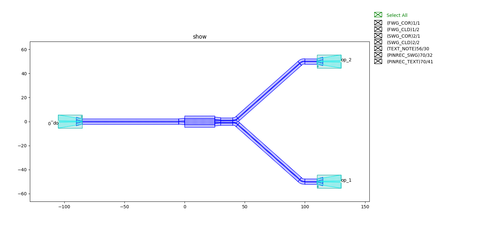
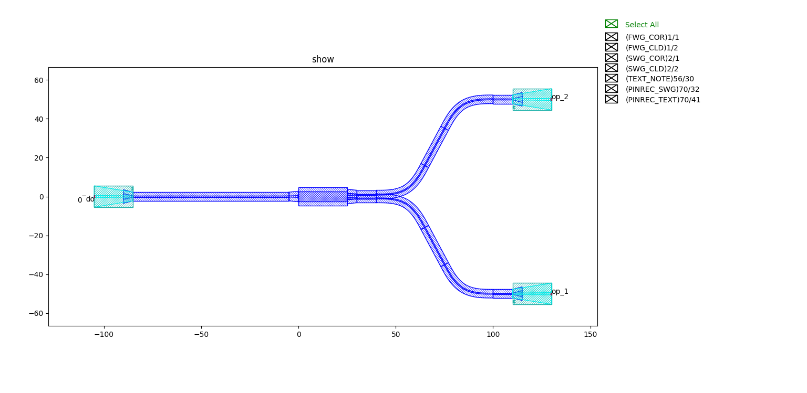

waveguide_factory_py
============================================================

该脚本主要为实现自动布线中端口获取以及弯曲布线提供更智能的方案。主要包括：

- 直波导_
- 弯曲波导_
- 欧拉弯曲_
- 案例

直波导
---------------------------

类定义::

    @dataclass(frozen=True)
    class StraightFactory(fpt.IStraightWaveguideFactory):
        def __call__(self, type: fpt.IWaveguideType, length: float):
            from gpdk.components.straight.straight import Straight

            straight = Straight(length=length, waveguide_type=type)
            return straight, ("op_0", "op_1")

返回直波导与端口信息，为自动布线时端口连接提供支持。

弯曲波导
---------------------------

类定义::

    @dataclass(frozen=True)
    class CircularBendFactory(fpt.IBendWaveguideFactory):
        radius_eff: float
        waveguide_type: fpt.IWaveguideType = field(repr=False, compare=False)

        def __call__(self, central_angle: float):
            from gpdk.components.bend.bend_circular import BendCircular, BendCircular90_FWG_C_WIRE, BendCircular90_FWG_C_EXPANDED
            from gpdk.technology import get_technology

            TECH = get_technology()

            radius_eff = self.radius_eff

            bend = None
            if fp.is_close(abs(central_angle), math.pi / 2):
                if self.waveguide_type == TECH.WG.FWG.C.WIRE:
                    bend = BendCircular90_FWG_C_WIRE()
                elif self.waveguide_type == TECH.WG.FWG.C.EXPANDED:
                    bend = BendCircular90_FWG_C_EXPANDED()

                if bend and central_angle < 0:
                    bend = bend.v_mirrored()

            if bend is None:
                bend = BendCircular(degrees=math.degrees(central_angle), radius=radius_eff, waveguide_type=self.waveguide_type)

            return bend, radius_eff, ("op_0", "op_1")

可以选择设定的参数为

- radius_eff 半径
- waveguide_type 波导类型

返回弯曲波导以及半径与端口信息。

欧拉弯曲
---------------------------

类定义::

    @dataclass(frozen=True)
    class EulerBendFactory(fpt.IBendWaveguideFactory):
        radius_min: float
        l_max: float
        waveguide_type: fpt.IWaveguideType = field(repr=False, compare=False)

        def __call__(self, central_angle: float):
            from gpdk.components.bend.bend_euler import BendEuler, BendEuler90, BendEuler90_FWG_C_WIRE, BendEuler90_FWG_C_EXPANDED
            from gpdk.technology.interfaces import CoreCladdingWaveguideType
            from gpdk.technology import get_technology

            TECH = get_technology()

            bend = None
            if fp.is_close(abs(central_angle), math.pi / 2):
                if self.waveguide_type == TECH.WG.FWG.C.WIRE:
                    bend = BendEuler90_FWG_C_WIRE()
                elif self.waveguide_type == TECH.WG.FWG.C.EXPANDED:
                    bend = BendEuler90_FWG_C_EXPANDED()
                elif isinstance(self.waveguide_type, CoreCladdingWaveguideType):
                    bend = BendEuler90(slab_square=True, radius_min=self.radius_min, l_max=self.l_max, waveguide_type=self.waveguide_type)

                if bend and central_angle < 0:
                    bend = bend.v_mirrored()

            if bend is None:
                bend = BendEuler(degrees=math.degrees(central_angle), radius_min=self.radius_min, l_max=self.l_max, waveguide_type=self.waveguide_type)

            return bend, bend.raw_curve.radius_eff, ("op_0", "op_1")

可以选择设定的参数为:

- radius_min 最小半径
- l_max 欧拉螺旋在半弯曲中的最大长度
- waveguide_type 波导类型

返回欧拉弯曲，以及欧拉弯的等效半径以及相应的端口信息。

案例
---------------------------

原始模型::

    from pathlib import Path

    gds_file = Path(__file__).parent / "local" / Path(__file__).with_suffix(".gds").name
    library = fp.Library()

    TECH = get_technology()
    # =============================================================
    # fmt: off
    from gpdk.components.directional_coupler.directional_coupler_sbend import DirectionalCouplerSBend
    from gpdk.components.mmi.mmi import Mmi
    from gpdk.technology.waveguide_factory import EulerBendFactory

    library += [
            HFanout(name="mmi",device=Mmi(waveguide_type=TECH.WG.FWG.C.WIRE), left_spacing=100, right_spacing=100, left_distance=100,
                    right_distance=100,
                    left_waveguide_type=TECH.WG.SWG.C.WIRE,
                    right_waveguide_type=TECH.WG.SWG.C.WIRE)
        ]
    # fmt: on
    # =============================================================
    fp.export_gds(library, file=gds_file)
    fp.plot(library)

通过欧拉弯曲'EulerBendFactory()'引导走线的模型::

    from pathlib import Path

    gds_file = Path(__file__).parent / "local" / Path(__file__).with_suffix(".gds").name
    library = fp.Library()

    TECH = get_technology()
    # =============================================================
    # fmt: off
    from gpdk.components.directional_coupler.directional_coupler_sbend import DirectionalCouplerSBend
    from gpdk.components.mmi.mmi import Mmi
    from gpdk.technology.waveguide_factory import EulerBendFactory

    def bend_factories(waveguide_type: fp.IWaveguideType):
        if waveguide_type == TECH.WG.FWG.C.WIRE:
            return EulerBendFactory(radius_min=15, l_max=15, waveguide_type=waveguide_type)
        return waveguide_type.bend_factory

    library += [
            HFanout(name="mmi",device=Mmi(waveguide_type=TECH.WG.FWG.C.WIRE), left_spacing=100, right_spacing=100, left_distance=100,
                    right_distance=100,
                    bend_factories=bend_factories,
                    left_waveguide_type=TECH.WG.SWG.C.WIRE,
                    right_waveguide_type=TECH.WG.SWG.C.WIRE)
        ]
    # fmt: on
    # =============================================================
    fp.export_gds(library, file=gds_file)
    fp.plot(library)

最终走线结果对比：

